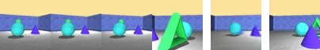

## Neural scene representation and rendering: Generative Query Network

This is a PyTorch implementation of the Generative Query Network (GQN)
described in the DeepMind paper "Neural scene representation and
rendering" by Eslami et al. For an introduction to the model and problem
described in the paper look at the article by [DeepMind](https://deepmind.com/blog/neural-scene-representation-and-rendering/).

Current solution is heavily based on [this code](https://github.com/wohlert/generative-query-network-pytorch).

Code is tailored for Rooms Ring Camera dataset.


###Training

####Training data
To download dataset you need [gsutil](https://cloud.google.com/storage/docs/gsutil)
```
gsutil -m cp -R gs://gqn-dataset/rooms_ring_camera data/
```

Data is stored in tfrecords. To convert to .npy format you should use scripts/tfrecord-converter.py script
```
python tfrecord-converter.py data/ rooms_ring_camera -b 36 -m "train"
python tfrecord-converter.py data/ rooms_ring_camera -b 36 -m "test"
```

Or you can use scripts/data.sh script.

####Training
To train GQN model you need run `run-gqn.py`
```
python run-gqn.py --data_dir=data/rooms-ring-camera/ --workers=15 --L=10
```
Or use `train.sh` script.


####Training process
During the training process, losses are written in `main.log` file. To visualize the content of log file you can use 
`read_logs.py` script. 

It will generate following result:  


First row: Total loss, Reconstruction loss, KL divergence
Second row: Learning rate, Sigma


To generate predictions you can use `validations.py` script. It will read the last checkpoint from checkpoints/ folder
and run inference on specified number of context. 
Generated image has following structure: context | prediction | ground truth

Example:  
  
  
  
  
  


###Tests  
#### Rotation  
`tests/rotation.py` 

Rotates in random location from selected scene. Creates 36 images (rotates by approximately 10 degrees).


`tests/spatial_understanding.py`


### Results
Model was trained for 1.6 million iterations on Rooms Ring Camera dataset with 10 generative steps, using 
"Tower" representation network.


 
### Notes
Model has not learnt to completely render the Rooms Ring Dataset. It requires to play with random seeds to achieve 
great results. I suggest to try model with 12 generative steps. Some tests show that even with 8 generative steps 
model learns to reproduce good quality images. However, to force better representation learning I suggest to use 12
generative steps. 
